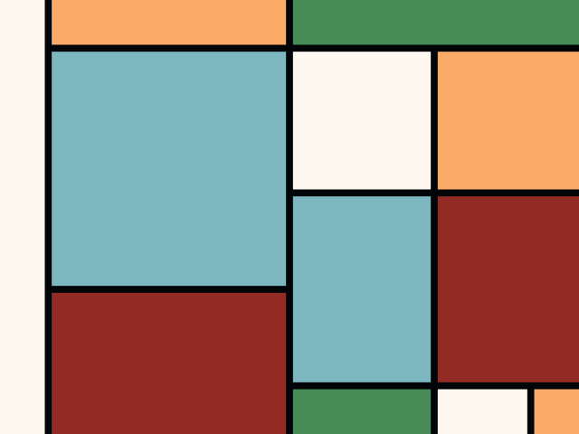
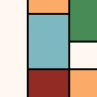
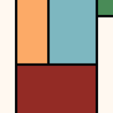
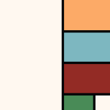
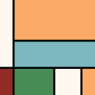
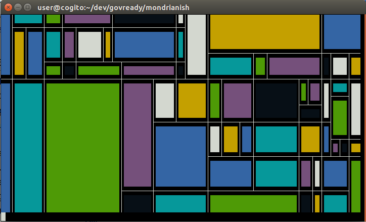

Mondrianish
===========

A Python 3.x module that generates a [Piet Mondrian-style image](https://en.wikipedia.org/wiki/Piet_Mondrian#Paris_.281919.E2.80.931938.29)
composed of rectangles of various colors and dark lines between them.

Other programs that create Mondrian-style images tend to recursively break up the canvas
into pieces, as if it were a fractal, but a general Mondrian-style image is not really
structured this way. The technique here instead is to draw lines first, adding only
horizontal and vertical lines that terminate at the edge of the canvas or at another
line, and then afterward seeing how those lines break up the canvas into rectangles.

---

---

   

---

## Installation

The module uses the `Cairo` 2D drawing library via `cairocffi`. See [cairocffi's installation instructions](http://cairocffi.readthedocs.io/en/latest/overview.html) if this doesn't work out of the box.

To install this module:

	pip3 install mondrianish

A global script `mondrianish` will be installed as well as an importable Python 3 module.

## Testing on the console

Run the module directly from a Unix console to display a randomly generated image on
the console (using `curses`):

	mondrianish

It will show something like:

(Press any key to exit.)

## Generating images on the command line

Render an image to a file by specifying a file format and size and redirecting the output to a file:

	mondrianish --size 800x600 svg > image.svg

Allowed formats are `svg`, `png`, and `text` (for ASCII art!).

### Options

Control the size of the generated image using `--size WIDTHxHEIGHT`.

Control the thickness of the black lines using `--stroke-width THICKNESS`.

The number of strokes is chosen automatically based on the image size and stroke width.

Control the colors by specifying `--color COLOR` for each color you want to use in the image. Each color can be a CSS color name or hex value like `#FCAA67` (anything [colour](https://pypi.python.org/pypi/colour) can parse). The colors are assigned to the rectangles randomly.

## Importing the Python module

### Generating an image

To use this module in a Python script, generate an image using `mondrianish.generate_image`:

	from mondrianish import generate_image

	colors = ("#FFF8F0", "#FCAA67", "#7DB7C0", "#932b25", "#498B57")
	with open("output.png", "wb") as f:
		generate_image("png", (400, 300), 15, colors, f)

### Generating the schematic of an image

You can also get finer control over the drawing process by generating the
lines and rectangles first on a virtual grid:

	from mondrianish import generate_grid
	lines, rects = generate_grid((10, 10), density=.5)

`generate_grid` returns two lists, `lines` and `rects`, which give the coordinates
of the lines and rectangles that make up the Mondrian-like image on a grid, with
integer coordinates in the range passed to `generate_grid`. Each line and rectangle
is a tuple of start and ending coordinates. For instance:

	lines = [((6, 0), (6, 9)),
	         ((1, 0), (1, 9)),
	         ((4, 0), (4, 9)),
	         ((4, 8), (9, 8)),
	         ((0, 6), (6, 6)),
	         ((8, 0), (8, 9)),
	         ((6, 4), (9, 4)),
	         ((6, 2), (8, 2)),
	         ((8, 6), (9, 6))]

	rects = [((0, 0), (1, 6)),
	         ((0, 6), (1, 9)),
	         ((1, 0), (4, 6)),
	         ((1, 6), (4, 9)),
	         ((4, 0), (6, 6)),
	         ((4, 6), (6, 8)),
	         ((4, 8), (6, 9)),
	         ((6, 0), (8, 2)),
	         ((6, 2), (8, 4)),
	         ((6, 4), (8, 8)),
	         ((8, 0), (9, 4)),
	         ((8, 4), (9, 6)),
	         ((8, 6), (9, 8)),
	         ((6, 8), (8, 9)),
	         ((8, 8), (9, 9))]

You can increase or decrease the `density` parameter to fill the grid
with more or fewer lines and rectangles.

Once you get the line and rectangle coordinates, you are responsible for
drawing them on an image.

## Running as a web server

You can also run it as a Flask app to create a little web server to serve generated images:

	pip3 install Flask
	FLASK_APP=mondrianish flask run

Then visit `http://127.0.0.1:5000/image/{width}/{height}/{format}` to download images, like [http://127.0.0.1:5000/image/128/128/png](http://127.0.0.1:5000/image/1280/1280/png).

## Other Mondrian-like picture generators

For other generators, see [JEFworks/mondrian-generator](https://github.com/JEFworks/mondrian-generator) and her list.
